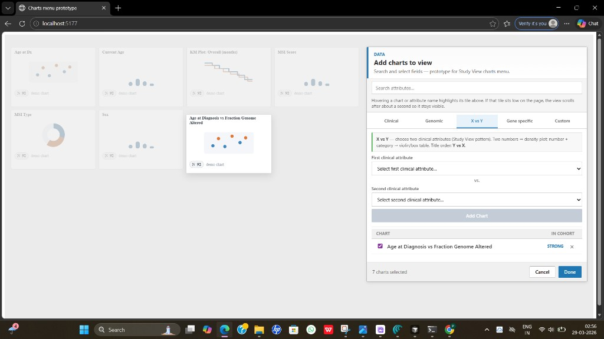

# Study View charts menu — UI prototype

Standalone **React + Vite** mockup for a richer **“Add charts to view”** experience on cBioPortal **Study View** (clinical rail + list, tabs, X vs Y flow, mock chart tiles). Data is **static**; this is for layout and interaction only.

**Example remote:** [github.com/Pragati5-DEBUG/mockupcbio](https://github.com/Pragati5-DEBUG/mockupcbio) (push this folder as the repo root if you use that project).

## Screenshot

Mock summary grid with **Add charts** panel; **X vs Y** tab selected, hover highlight on a tile.



## Prerequisites

- **Node.js** 18+ (LTS recommended)

## Quick start

```bash
npm install
npm run dev
```

Open the URL Vite prints (often `http://localhost:5173/`; another port if that one is busy).

## Scripts

| Command            | Description                                      |
| ------------------ | ------------------------------------------------ |
| `npm run dev`      | Dev server with hot reload                       |
| `npm run build`    | Typecheck + production build → `dist/`           |
| `npm run preview`  | Serve `dist/` locally                            |
| `npm run test`     | Run Vitest once (unit + component-level tests)   |
| `npm run test:watch` | Vitest watch mode                            |

## What to try in the UI

- **Summary grid** (left) shows mock tiles for “selected” attributes; **Add charts** panel (right) stays **beside** the grid so tiles are not covered.
- **Clinical** tab: category **rail** + attribute list; **search** narrows across groups.
- **X vs Y** tab: pick two attributes, add a chart row; **hover** a row to highlight the matching tile (demo behavior).
- **Genomic** / **Gene specific** / **Custom**: placeholders or partial flows.

## Project layout

| Path                       | Role                                      |
| -------------------------- | ----------------------------------------- |
| `src/ChartsMenuPrototypePage.tsx` | Page shell: grid + dialog column   |
| `src/ChartsMenuDialog.tsx` | Add-charts panel (header, tabs, body)     |
| `src/StudyViewGrid.tsx`    | Mock chart tiles                          |
| `src/XvsYPanel.tsx`        | X vs Y picker and “added charts” list     |
| `src/mockData.ts`          | Demo fields and helpers                   |
| `src/xvsyTypes.ts`         | X vs Y types + small helpers              |
| `src/*.spec.ts(x)`         | Vitest tests                              |

## Tests

- **Unit:** `mockData.spec.ts` (`cohortWord`, `bandSort`).
- **Integration-style (jsdom):** `ChartsMenuPrototypePage.spec.tsx` — render page, dialog, tab switch, checkbox toggle.

## Pushing to GitHub

From this directory (as repo root):

```bash
git init
git add .
git commit -m "Initial commit: charts menu prototype"
git branch -M main
git remote add origin https://github.com/Pragati5-DEBUG/mockupcbio.git
git push -u origin main
```

Use your own URL if the remote differs. Ensure `node_modules/` and `dist/` stay ignored (see `.gitignore`).

## Disclaimer

This repository is an **independent prototype** for exploration and mentor review. It is **not** an official cBioPortal release.
